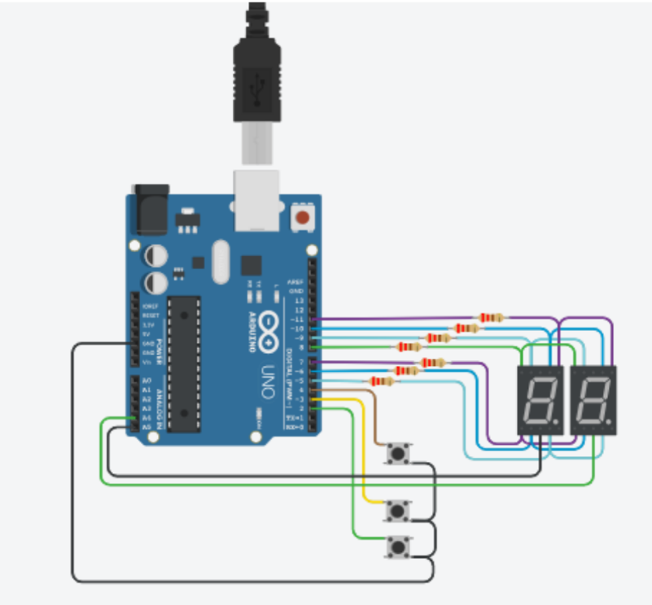
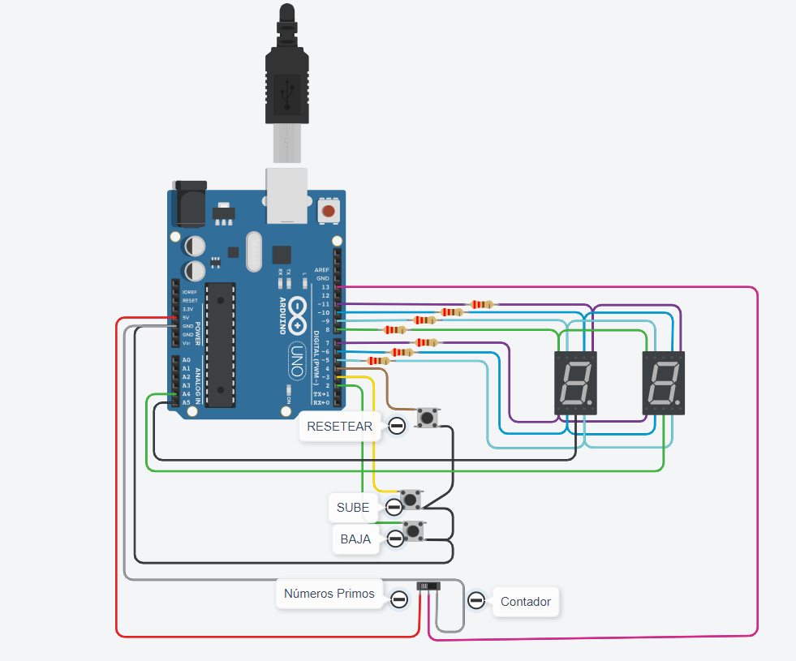

# :file_folder: Primer Parcial de SPD

### :scroll: INTEGRANTES 
-  Grajeda juliana Gimena
*  Lopez Camilo Garcia
+  Loroño Luis Fernando

## 📖 Proyecto Parte Uno: Contador 0 al 99

### 	:computer: Link al Proyecto
[Tinkercad](https://www.tinkercad.com/things/5K5WYnyHAHB)

### Descripción
> Este es el código de un circuito que, gracias a sus botones, puede contar del 0 al 99 y viceversa. Además, cuenta con un botón que te permite resetear el contador a 0 en caso de querer volver a empezar

##  Proyecto Parte Dos: Contador + Interruptor deslizante(SWITCH)

### 	:computer: Link al Proyecto

[Tinkercard](https://www.tinkercad.com/things/0jGSMg5g407)

### Descripción

> Este es un código parecido al anterior solo que ahora tiene un interruptor deslizante que te permite optar por mostrar únicamente numeros primos o contar en el orden correcto

